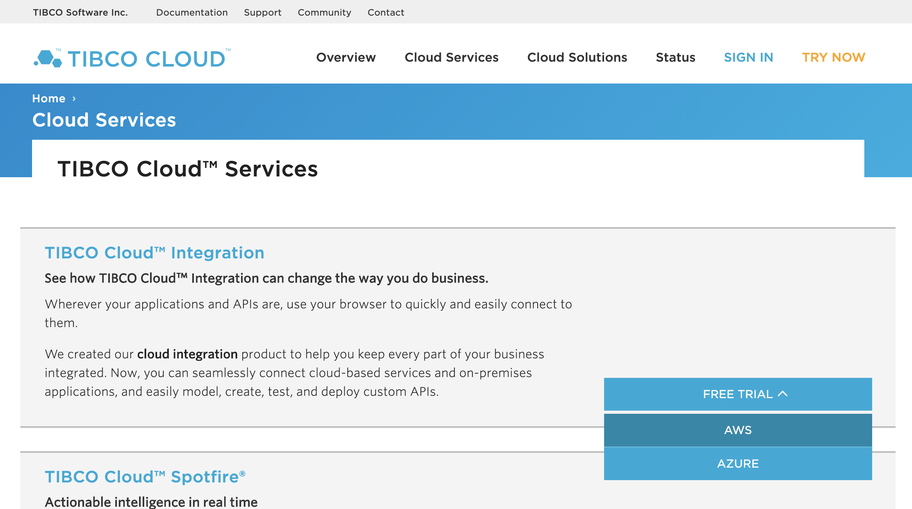
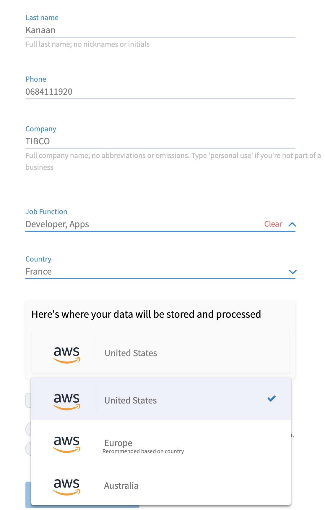

# 1. Validate Your Environment #

In this section, you'll validate your lab environment, which consists of a client machine and a TIBCO Cloud Integration trial environment.

## 1.1 Sign in to TIBCO Cloud ##

### 1.1.1 Getting Ready ###

You will now start a trial of TIBCO Cloud™ Integration. 

First, [click here](https://cloud.tibco.com/cloud-services), then, under TIBCO Cloud Integration, click on **free trial** -> **AWS**. 

Fill the form and choose **United States** from the last drop down list

Click on **Start your free trial**
   
You will receive now a mail, please click on the link to activate your account.

### 1.1.2 How to Do It ###

1. Browse to [https://cloud.tibco.com/](https://cloud.tibco.com/).

    
2. Click **SIGN IN** (at the right top), and fill out the relevant account details (**Email Address** and **Password**) in the following screen.

    
3. After this, you should see a landing page which looks similar to this - please ensure that the region is **OREGON**:

    

## 1.2 Additional tools ##

Besides TIBCO Cloud Integration, the following software will be used:

* [Postman](https://www.getpostman.com/downloads/)

## 1.3 What's Next ##

[Design an API and Create a Mock Application](001.md)
