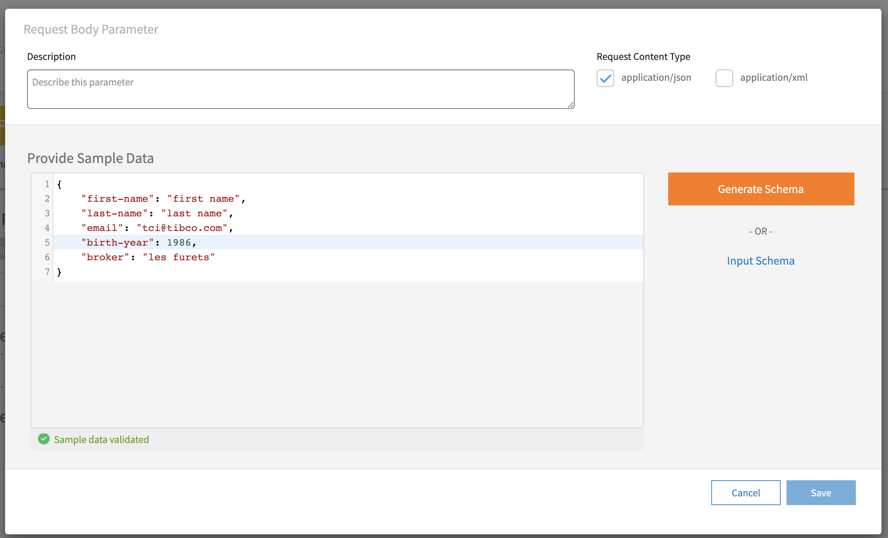
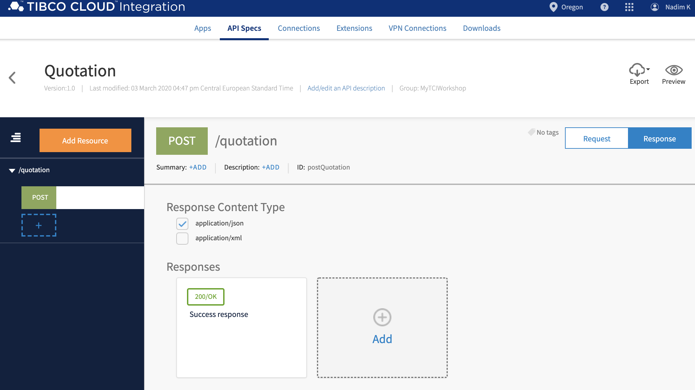
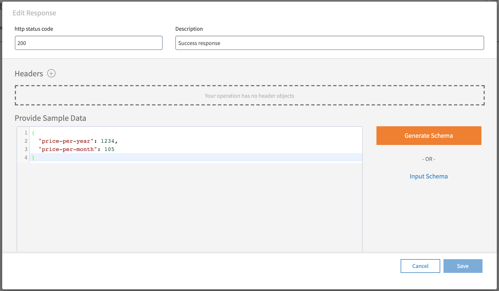
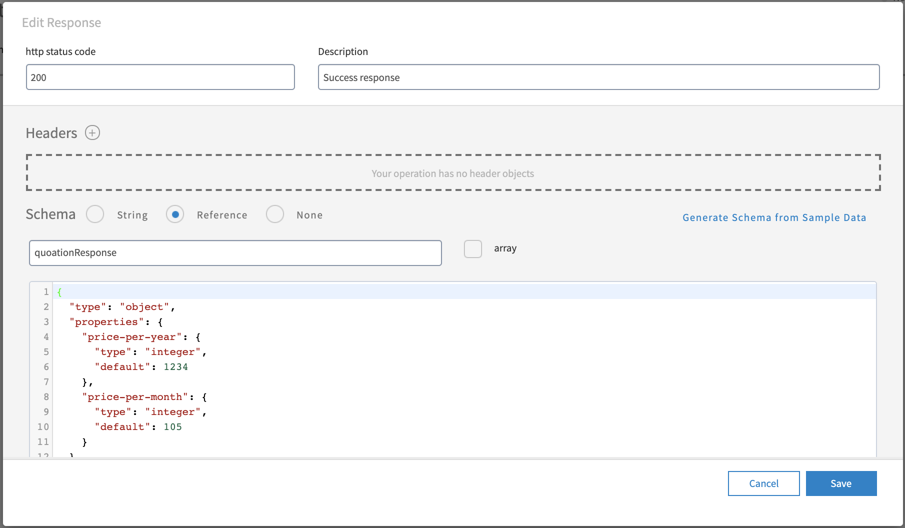
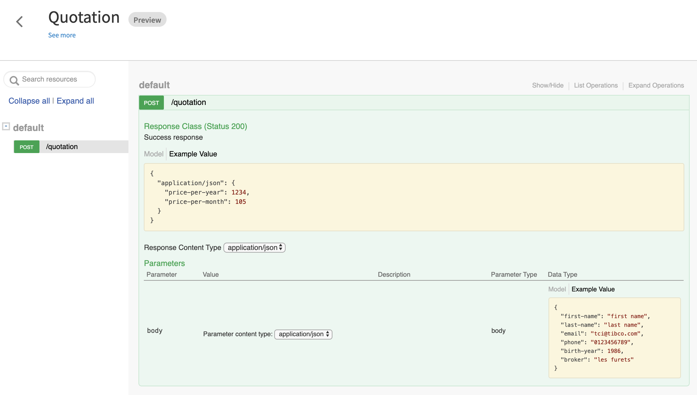
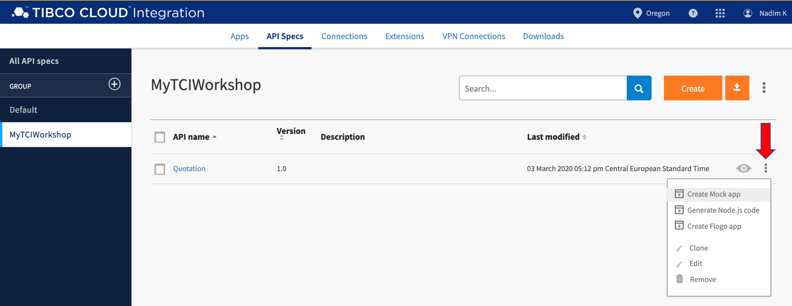
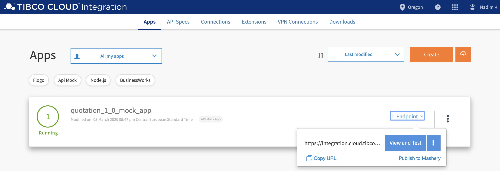
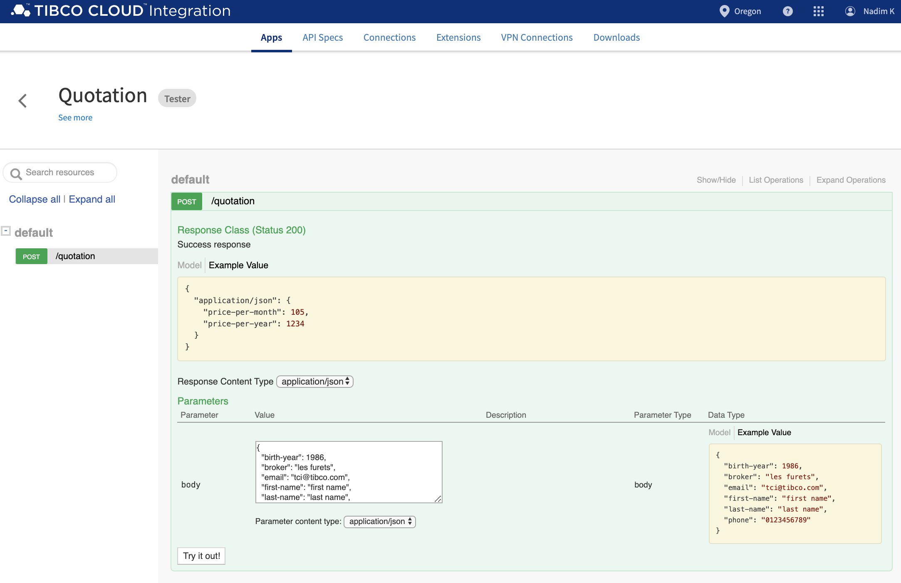

# 2. Design an API and Create a Mock Application #

**API Modeler** is a web-based tool that provides you with the capability to graphically create and model a REST API.

With API Modeler, you can import REST API specifications either in a YAML or JSON file for further editing, or model your own REST API step-by-step in a visual interface. After modeling an API, you can choose to mock it and see the API in action, or directly implement it.

In this section, you'll design an API using API Modeler and generate a mock application based on it. Furthermore, you'll import several API specs.

* Design an API
* Create a Mock App
* Import API Specs

## 2.1 Design an API ##

### 2.1.1 Getting Ready ###

In this lab, you'll create an API using the API Modeler. To navigate from the landing page to the API Modeler, do the following:

1. Navigate from the TIBCO Cloud landing page to Cloud Integration by clicking the **Integration** hexagon.
2. Click either one of the **Scribe**/**Flogo**/**BusinessWorks** links.
3. In the resulting screen, click on the **API Specs** menu section to the right of **Apps**.
4. After this, your screen should look similar to this:

    

### 2.1.2 How to Do It ###

1. Create a group (this is optional) by clicking the **+** sign to the right from **GROUP** and give it a name e.g. **MyTCIWorkshop**.
2. Create an API spec by clicking on **MyTCIWorkshop**, and click on the orange **Create** button.
3. In the form, use the following values:

    | Field        | Value         |
    | ------------ | ------------- |
    | API name     | Quotation   |
    | Version      | 1.0           |
    | Select Group | MyTCIWorkshop |

    The form should look something like this:

    

    Click the blue **Create** button

4. Add a resource to the API spec by clicking on the orange **Add Resource** button in the next **Quotation** screen.
5. In the form, use the following values:

    | Field         | Value           |
    | ------------- | --------------- |
    | Resource path | /quotation|
    | Method        | POST            |

    The form should look something like this:

    

    Click on the blue **Save** button.
6. Edit the request body structure of the **POST** method by clicking on the **+Body parameter** button.
7. In the form, Copy the below sample json in the **Provide Sample Data** field :
	```json
    {
      "first-name": "first name",
      "last-name": "last name",
      "email": "tci@tibco.com",
      "phone" : "0123456789",
      "birth-year": 1986,
      "broker": "les furets"
	}
    ```
      
    
   Click on the orange Generate Schema button, and replace GiveNewSchemaNameHere by quotationRequest in the next form. Click on **Save**.
    
7. Edit the success response of the **POST** method by first clicking on the white **Response** button in the next **POST /quotation** screen, and then clicking on the **Success response** (**200/OK**) card.

    


8. In the form, click on the **Generate Schema from Sample Data** link, and then on the orange **Continue** button. Copy the below sample json in the **Provide Sample Data** field:

    ```json
    {
      "price-per-year": 1234,
      "price-per-month": 105
	}
    ```

    The form should look something like this:

    

    Click on the orange **Generate Schema** button, and replace **GiveNewSchemaNameHere** by **quoationResponse** in the next form. The form should look something like this:

    

    Click on the blue **Save** button.
8. Click on the **Preview** icon, and your screen should look similar to this:

    

## 2.2 Create a Mock App ##

### 2.2.1 Getting Ready ###

In this lab you'll create a mock application based on the API specification created in the previous lab. In order to do this:

1. Navigate to the API specifications by clicking on the **API Specs** menu item.
2. Select the group you've created the **Quotation** API specification in, e.g. **MyTCIWorkshop**.
3. Your screen should look similar to:

    

### 2.2.2 How to Do It ###

1. Hover over the **Quotation** record to the right of the preview icon, and select **Create Mock app** from the menu:

    
2. Create a mock app by clicking on the **Create** button in next form:

3. Once the mock app is running, hover over the **Endpoint** link, and select **View and Test** from the menu:

    
4. Test the mock app by filling out a value in the required request parameters, and clicking on the **Try it out!** button:

    


## 2.3 See Also ##

* [How to Model Your API with TIBCO Cloud Integration](https://www.tibco.com/resources/tutorial-video/how-model-your-api-tibco-cloud-integration)
* [TIBCO Cloud Integration - API Modeler](https://integration.cloud.tibco.com/docs/apimodeler/index.html)
* [My first API with API Modeler](https://community.tibco.com/wiki/my-first-api-api-modeler)
* [TIBCO Cloud Integration - API Mock App](https://integration.cloud.tibco.com/docs/mockapp/index.html)
* [Testing APIs with Mock apps](https://community.tibco.com/wiki/testing-apis-mock-apps)
* [Meter Data Service API Mock for TIBCO Cloud Integration](https://community.tibco.com/wiki/meter-data-service-api-mock-tibco-cloud-integration)

## 2.4 What's Next ##

[Build and Deploy Your API](002.md)
