# 3. Build and Deploy Your API #

In this section you'll push an app implemented in BusinessWorks from Business Studio to TIBCO Cloud. Functionally, the app implements a system API that gets purchase orders from SAP Hana.

After that you'll create a Flogo app that implements a process API that creates sales orders, by first invoking the system API that gets a purchase order from SAP Hana, then invoking a system API that gets contact details from Salesforce, and finally creates a sales order by invoking a system API for SAP ERP.

* BusinessWorks Apps in TIBCO Cloud Integration
    * Connect Business Studio to TIBCO Cloud
    * Import a Project in to Business Studio
    * Push the Project to TIBCO Cloud and Test It
* Flogo Apps in TIBCO Cloud Integration
    * Create the Skeleton Flogo App from the API Specification
    * Implement the Flogo App
    * Push the Flogo App to TIBCO Cloud and Test It

## 3.1 BusinessWorks Apps in TIBCO Cloud Integration ##

In this lab, you'll first connect TIBCO Business Studio™ for BusinessWorks from your workstation to TIBCO Cloud. You'll then import a BusinessWorks project into Business Studio that implements a system API that gets purchase orders from SAP Hana. Finally, you'll push the BusinessWorks app to TIBCO Cloud and test it.

### 3.1.1 Getting Ready ###

To get ready, open TIBCO Business Studio™ for BusinessWorks. Assuming you start with a clean enviroment, your screen should look similar to this:


### 3.1.2 How to Do It: Connect Business Studio to TIBCO Cloud ###

To setup a connection from TIBCO Business Studio™ for BusinessWorks to TIBCO Cloud that enables you to push an app to the cloud directly from TIBCO Business Studio, do the following:

1. Go to API Explorer, click the down arrow in the upper right corner, and click Settings.

    

2. In the **Configure API Settings** form, click the **New** button. Fill out the **URL** and your TIBCO Cloud Integration username and password in the new form.

    | Field         | Value           |
    | ------------- | --------------- |
    | URL           | `https://integration.cloud.tibco.com:443` |
    | Username      | `your@email.com` |
    | Password      | `YoUrPassWoRd`   |

    Your screen should look like this:

    

3. Click the **Finish** button when your done done, and click the **Close** button in the **Configure API Settings** form. The API Explorer should look like this:

    

### 3.1.3 How to Do It: Import a Project in to Business Studio ###

To import a BusinessWorks project into Business Studio that implements a system API, do the following:

1. From the menu, select **File > Import**. In the new form, select **General > Existing Studio Projects into Workspace**.

2. Select the [`tci_workshop_stubs.zip`](../src/bw_projects/tci_workshop_stubs.zip) file from the [`src/bw_projects`](../src/bw_projects) directory. Your screen should look like this:

    

3. Click the **Finish** button. The Project Explorer should look like this:

    

### 3.1.4 How to Do It: Push the Project to TIBCO Cloud and Test It ###

To push the SAP Hana system API app to TIBCO Cloud, do the following:

1. In the Project Explorer, select **SAPHanaAPI > Push to Cloud ...**:

    

2. Navigate to TIBCO Cloud, and once the app has been successfully pushed, your screen should look like this:

    

3. Once the **SAPHanaAPI** app is running, hover over the **Endpoint** link, and select **View and Test** from the menu

4. Test the **SAPHanaAPI** app by filling out a value in the **orderId** field, and clicking on the **Try it out!** button:

    

5. Copy the URL, which has a pattern like `https://integration.cloud.tibcoapps.com:443/xxxxx/PurchaseOrders/purchaseOrders/{orderId}`, and store it somewhere. You will need it when you implement the process API in the next lab.

## 3.2 Flogo Apps in TIBCO Cloud Integration ##

In this lab you'll implement a process API that creates a qotation, by first invoking the system API that gets a rate from the pricing engine, then invoking a system API that create a quotation in Salesforce.

You will first create a "skeleton" Flogo app from the **Quotation** API specification. Then you will implement the flow with the system API and salesforce calls, to finally push the Flogo app and test it.

### 3.2.1 Getting Ready ###

To be able to create the "skeleton" Flogo app from the **Quotation** API specification, do the following:

1. Navigate to the API specifications by clicking on the **API Specs** menu item.
2. Select the group you've created the **Quotation** API specification in, e.g. **MyTCIWorkshop**.
3. Your screen should look similar to:

    
    
#### Set up Salesforce connection ####

From TIBCO Cloud home page, navigate to _Integration_ hexagon, then _Flogo_ section.

Go to _Connections_ tab.

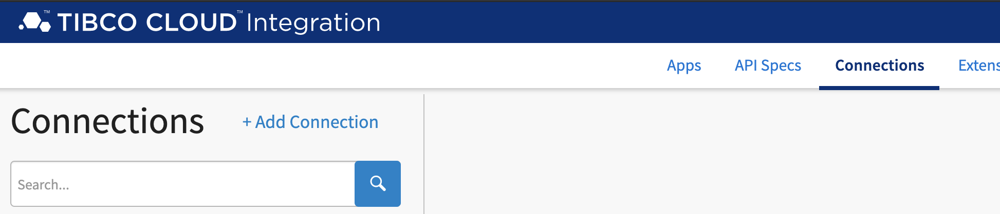

Click on add connection 
Type Salesforce in the search field and click on **Salesforce Connector**

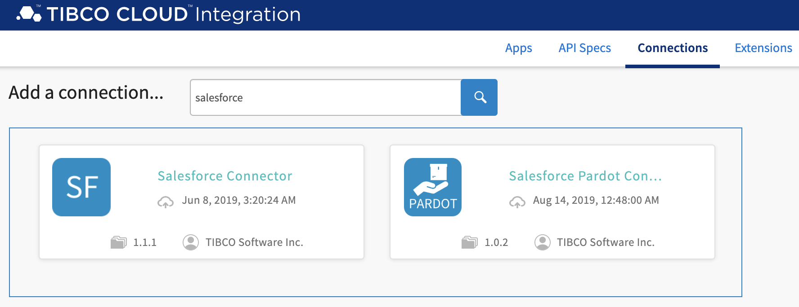

Give it the Name "SalesforceConnection" and click on login. You will be redirected to salesforce.com. Use nadim.kanaan@gmail.com/*** credentials, and authorise access.

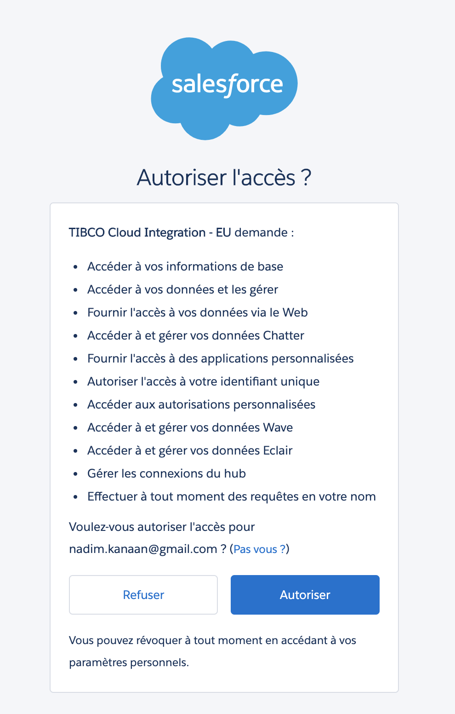

**Your Salesforce connector is now ready for use across TIBCO Cloud**.

#### Set up Twilio connection ####
What is Twilio?
Twilio is a cloud communications platform as a service company based in San Francisco, California. Twilio allows software developers to programmatically make and receive phone calls, send and receive text messages, and perform other communication functions using its web service APIs.

Go to _Connections_ tab.

Click on add connection

Type Twilio in the search field and click on **Twilio Connector**

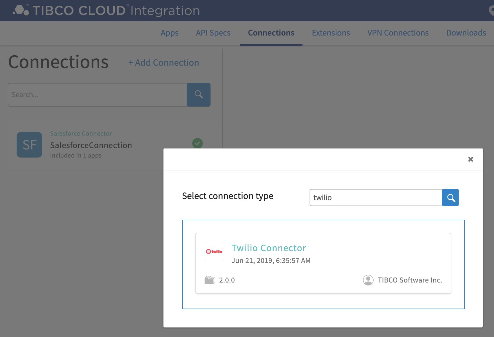

Give it a name: TwilioConnection

Select False under _Test Connection_

Account SID: ***

Auth Token: ***

Click on Connect


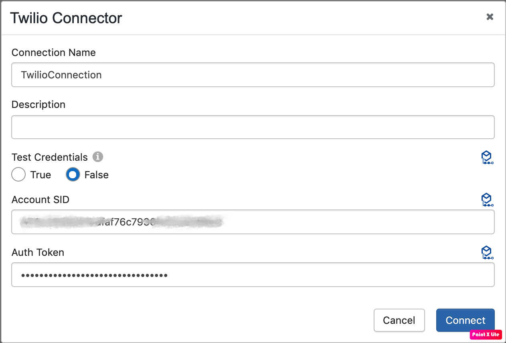

### 3.2.2 How to Do It: Create the Skeleton Flogo App from the API Specification ###

To create a "skeleton" Flogo app from on the **Quotation** API specification, do the following:

1. Hover over the **Quotation** record to the right of the preview icon, and select **Create Flogo app** from the menu:

    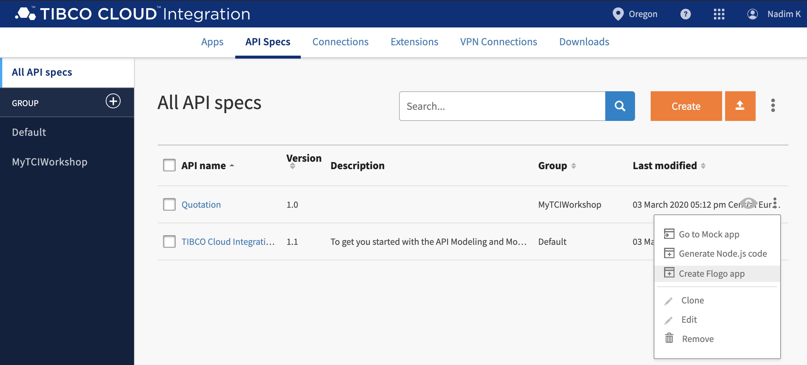
2. Create a Flogo app by clicking on the **Create** button in next form:

    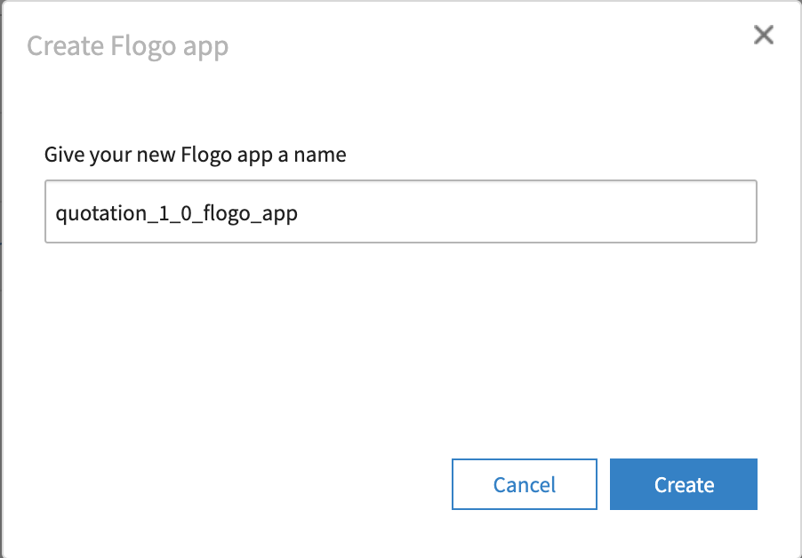

### 3.2.3 How to Do It: Implement the Flogo App ###

In this lab, you'll create a process API that creates a quotation by making calls to the system API (Pricing Engine) and to salesforce using _Flogo Connector for Salesforce_. The address of first system API call is provided below. 


To implement the process API, do the following:

1. Navigate from the app **quotation_1_0_flogo_app** to the skeleton flow **postQuotation_POST**.

2. To enable data to flow between the trigger and the flow, you first need to map the trigger output to the flow input, and flow data to the trigger reply. Click on the  icon to open the configuration of the **ReceiveHTTPMessage** trigger.

3. Map the trigger output to the flow input as follows:

    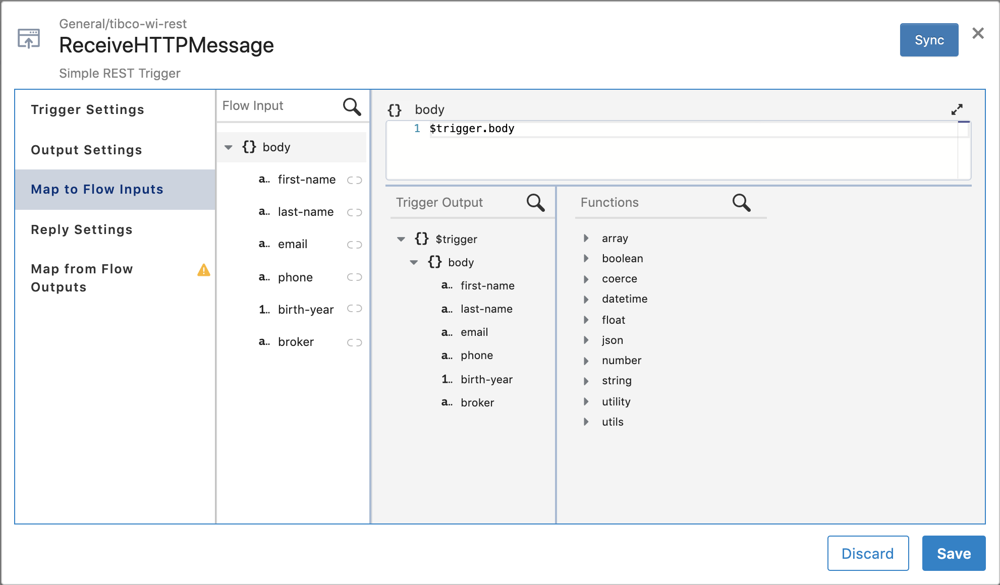

4. Map the flow data to the trigger reply as follows:

    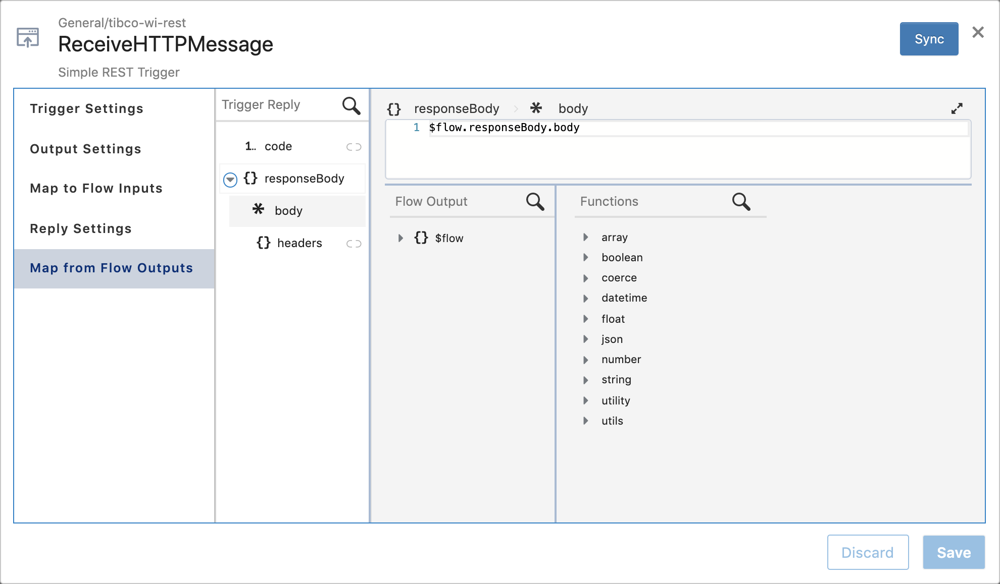

5. Close the trigger configuration screen, and move the **Return** tile at least 3 positions to the right. Create a first activity, by clicking on the left-most `+` and navigate through **General > Invoke REST Service**. Configure this activity as follows:

    1. Give it a name: **GetRate**.
    2. In the **Settings** section, specify the following fields:

        | Field         | Value           |
        | ------------- | --------------- |
        | Method  | GET |
        | URL | `https://eu-west-1.integration.cloud.tibcoapps.com/setcbasi7iyatvnq34bjnmufvzzygshn/engine/rate` |
        | Use certificate for verification | `false` |

    3. In the input settings section, add a parameter in the query params listing. Name it **year** and make it of type **number**
    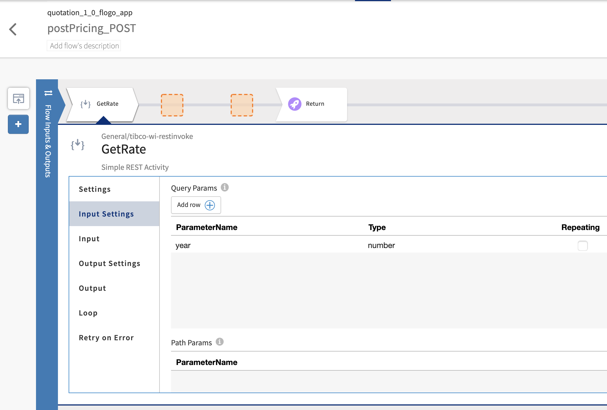
    4. In the **Input** section, create the following mapping:

        | Activity Input | Upstream Output |
        | -------------  | --------------- |
        | `queryParams.year` | `$flow.body["birth-year"]` |

    4. In the **Output Settings** section, ensure the **Response Type** is set to `application/json`, and copy the following json structure into the **Response Schema**:

        ```json
        {
  			"rate-per-month": 105,
  			"rate-per-year": 1234
		}
        ```

6. Save and Close the activity configuration screen, and create a second activity, by clicking on the next `+` and navigate through **Salesforce > Create**. Configure this activity as follows:

	1. Give it a name: **CreateQuotation**.
	2. In the **Settings** section, specify the following fields:

        | Field         | Value           |
        | ------------- | --------------- |
        | Connection  | SalesforceConnection |
        | Object | `Quotation__c` |

	3. In the **Input** section, map the following fields:

        | Parameter Name | Type |
        | -------------  | --------------- |
        | input/Quotation__c/records | array.forEach(array.create("one item array")) |
        | FullName__c | string.concat($flow.body["first-name"]," ", $flow.body["last-name"]) |
        | Email__c | $flow.body.email |
        | Yearly_Price__c | $activity[GetRate].responseBody["rate-per-year"] |
        | Monthly_Price__c | $activity[GetRate].responseBody["rate-per-month"] |
        | Broker_Organisation__c | $flow.body.broker |
        | Phone_Number__c | $flow.body.phone|

	4. **Save** and close the activity.

7. Create an additional activity, by clicking on the next `+` and navigate through **Twilio > Twilio Messages**. Configure this activity as follows:
	1. In the **Settings** section, pick TwilioConnection from the connection dropdown list and Send Message from the action dropdown list.
	2. In the **Input** section create the mapping for the following fields:
	
		|    Field        | Value           |
		| ------------- | --------------- |
	    | From | "16163845018" |
	    | To | string.concat("+33", string.substringAfter($flow.body.phone, "0")) |
	    | Body | string.concat("Bonjour,\n Suite à votre demande de devis, nous avons le plaisir de vous communiquer un tarif annuel de ", coerce.toString($activity[GetRate].responseBody["rate-per-year"]), ".\n Le service MyCompany")|

9. Close the activity configuration screen, and create an additional activity, by clicking on the next `+` and navigate through **General > Configure HTTP Response**. Configure this activity as follows:

    1. In the **Settings** section, pick code 200 from pick list
    2. In the **Input** section, create the mapping for the following fields:

        | Field         | Value           |
        | ------------- | --------------- |
        | input/body/price-per-year  | $activity[GetRate].responseBody["rate-per-year"] |
        | input/body/price-per-month | $activity[GetRate].responseBody["rate-per-month"] |

    
10. Close the activity configuration screen, and configure the **Return** activity as follows:

    1. In the **Input** section, create the following mapping:

        | Activity Input | Upstream Output |
        | -------------  | --------------- |
        | `code` | `200` |
        | `responseBody.body` | `$activity[ConfigureHTTPResponse].response` |

11. Save and Close the activity configuration screen. Your flow looks something like:

    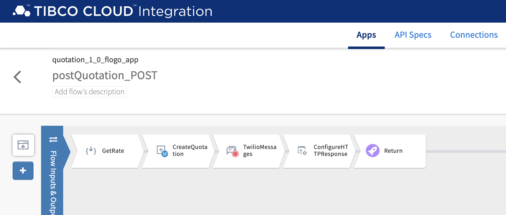

### 3.2.4 How to Do It: Push the Flogo App to TIBCO Cloud and Test It ###

To push the Flogo app and test it, do the following:

1. Click the **Push app** button.

2. Once the **quotation_1_0_flogo_app** app is running, hover over the **Endpoint** link, and select **View and Test** from the menu

3. Test the **quotation_1_0_flogo_app** app by filling out a value in the required fields, and clicking on the **Try it out!** button.

## 3.3 See Also ##

**BusinessWorks (Cloud Integration)**

* [TIBCO Cloud Integration: Getting Started with BusinessWorks Applications](https://community.tibco.com/wiki/tibco-cloud-integration-getting-started-businessworks-applications)
* [TIBCO Business Studio™ - Cloud Edition](https://integration.cloud.tibco.com/docs/bw/index.html)
* [TIBCO ActiveMatrix BusinessWorks™ Plug-ins](https://integration.cloud.tibco.com/docs/connectors/index.html)
* [TIBCO® Cloud Integration Frequently Asked Questions](https://community.tibco.com/wiki/tibcor-cloud-integration-frequently-asked-questions)

**Flogo (Cloud Integration)**

* [TIBCO Cloud Integration: Getting Started with Flogo](https://community.tibco.com/wiki/tibco-cloud-integration-getting-started-flogo)
* [TIBCO Flogo® apps](https://integration.cloud.tibco.com/docs/flogo/index.html)
* [TIBCO Flogo® Connectors](https://integration.cloud.tibco.com/docs/flogo_connectors/index.html)

**Project Flogo**

* [Project Flogo™ Community Wiki](https://community.tibco.com/wiki/project-flogo-community-wiki)
* [Project Flogo](http://www.flogo.io/)
* [Project Flogo Documentation](https://tibcosoftware.github.io/flogo/)
* [Project Flogo Github Repos](https://github.com/project-flogo)

## 3.4 What's Next ##

[Distribute & Manage your API](003.md)
