# 4. Distribute & Manage your API #

In this section you'll turn the Quotation API into a managed API by publishing it to Mashery. Within the Integration section of TIBCO Cloud, you will first publish an API endpoint to Mashery, specifying its API definition, API package and API plan. Then you will adjust the API definition and API package from within the APIs section of TIBCO Cloud, so you can create an application and register for an API key, and can adjust the interactive documentation of the API. After that, you will create an application, register for an API key, and then test the API with Postman, using the API key. Finally, you will create interactive documentation for the API, using a Open API Swagger specification, and then test the API from that documentation.

* Publish your API to Mashery
* Configure the API Definitions & API Packages
* Register an Application for an API Key
* Test the API using Postman
* Create Interactive Documentation

## 4.1 Publish your API to Mashery ##

### 4.1.1 Getting Ready ###

This lab assumes you've already navigated to the Flogo apps in the Integration capability, and can see the **quotation_1_0_flogo_app** running so your screen looks something like this:

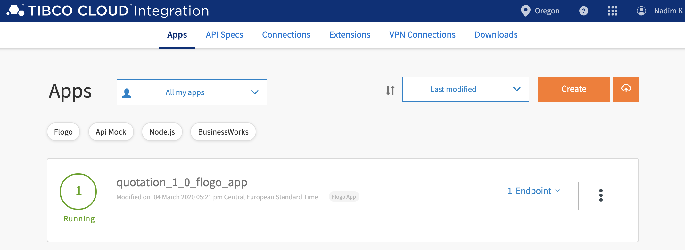

### 4.1.2 How to Do It ###

To publish the **Quotation** API to Mashery, do the following:

1. Hover over the **Endpoint** link, and select **Publish to Mashery** from the menu:

    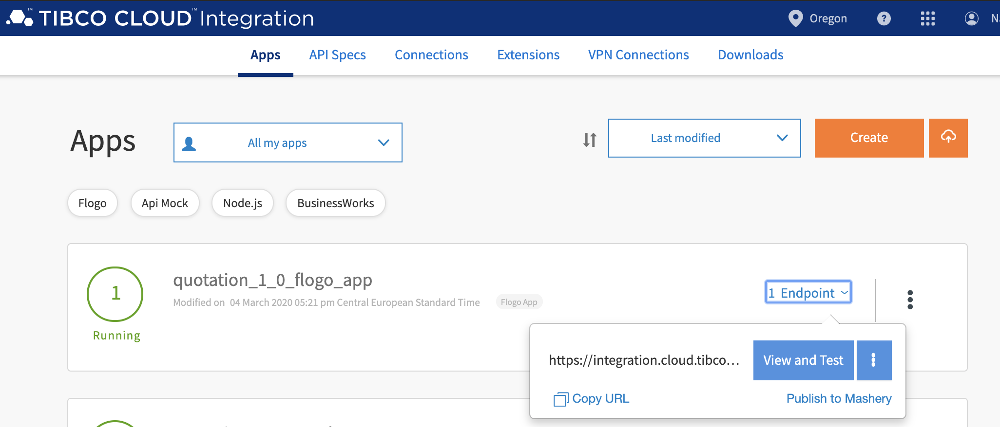

2. Select the traffic manager domain in the next form (**Note**: the name of the selected traffic manager domain should match the pattern below, i.e. **evalxxxxxx.api.mashery.com**), and click **Next**:

    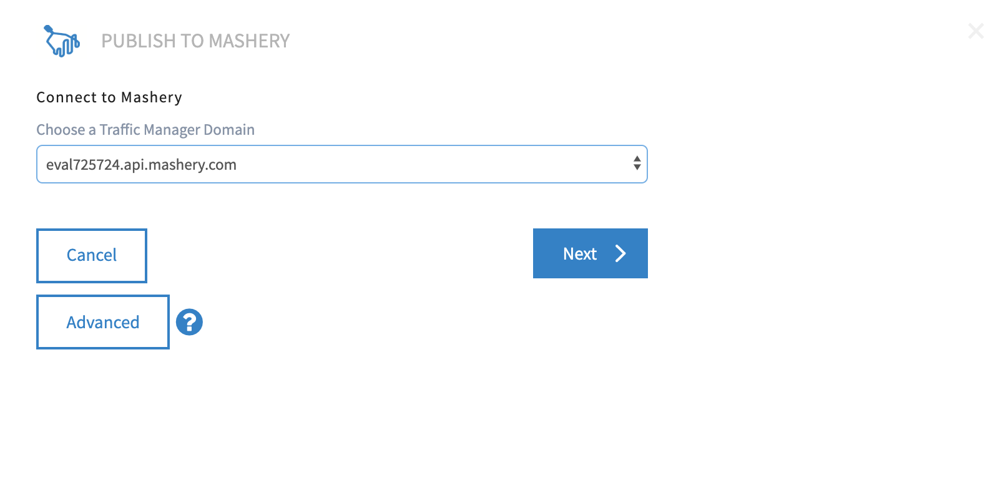

3. Create a new API definition by clicking on the **+ New definition** link in the next form. Give the definition a name, e.g. **QuotationAPI**, and click on the **Create** button.

    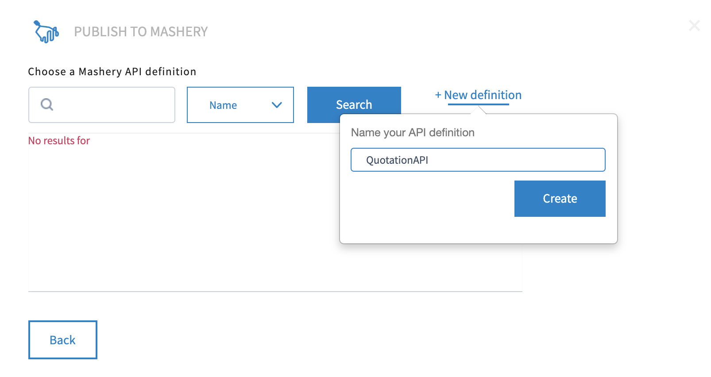

4. Select the **QuotationAPI**

    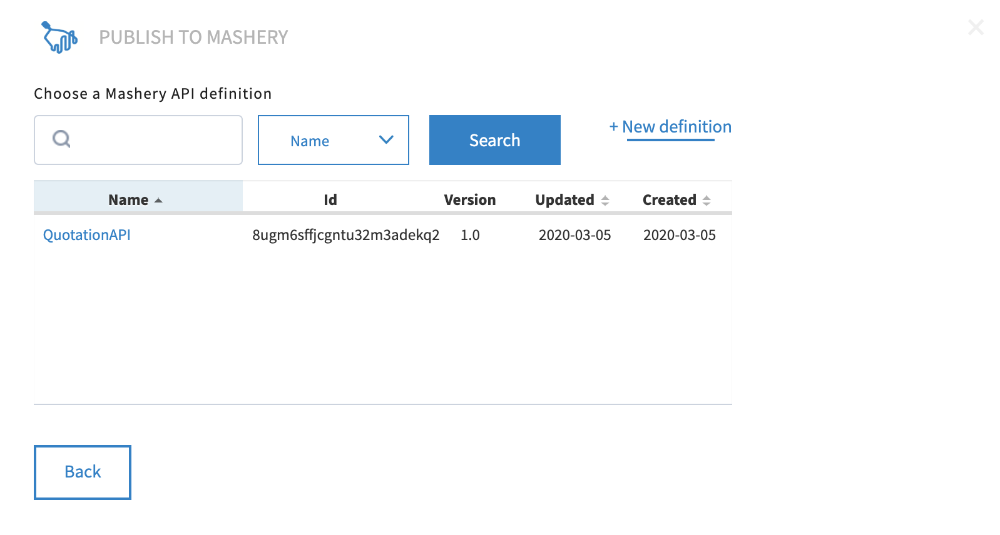

5. Select the operation **POST /sync/{orderId}** to publish to the **QuotationAPI**, and click **Next**:

    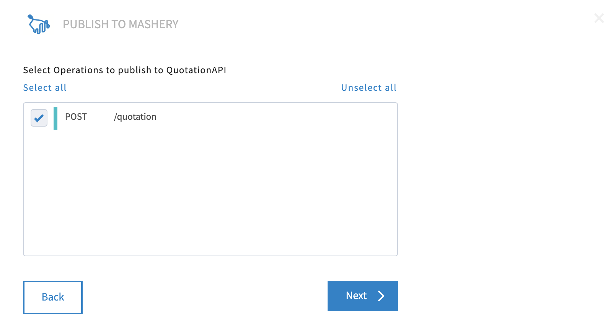

6. Create a package (click the **Create Package** button), give it a name, e.g. **QuotationPackage**, and click the **Create** button:

    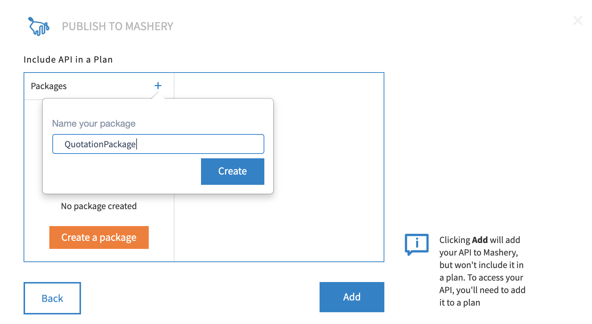

7. Select the **QuotationPackage**, create a plan (by clicking the **Create a plan** button), give it a name, e.g. **BasePlan**, and click the **Create** button (**Note**: ensure that the **Allow self-provisioning keys** box is checked):

    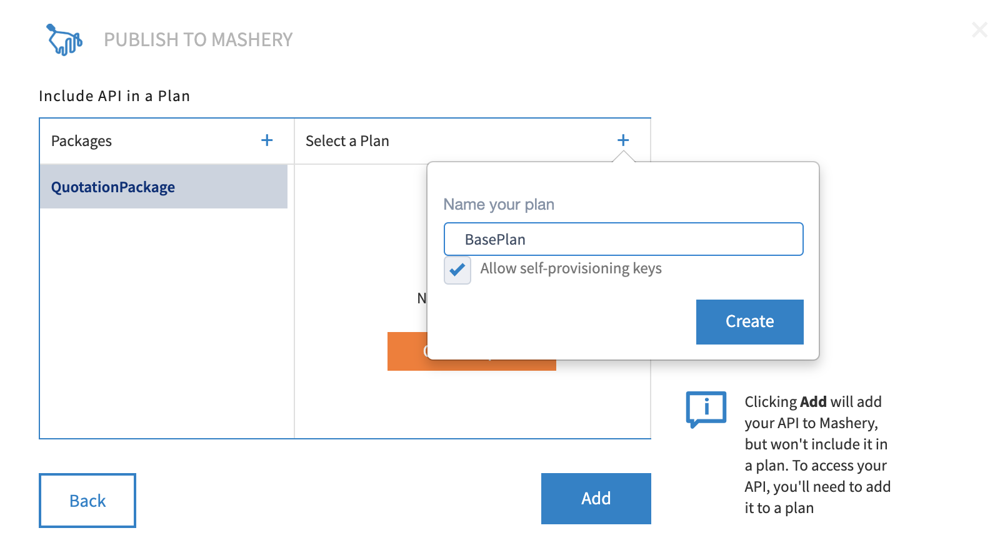

8. Tick the checkbox next to **BasePlan** to add the QuotationAPI to this plan.

	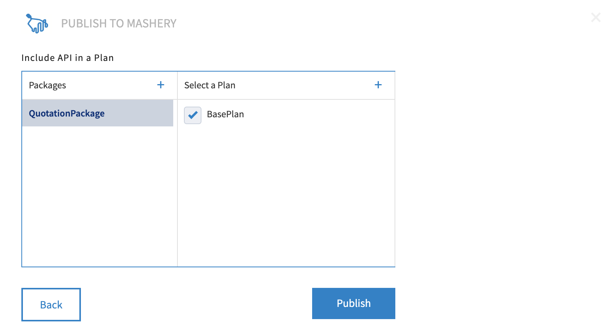

9. Click **Publish**, then, in the next form click **Done** when everything completed successfully:  

 	 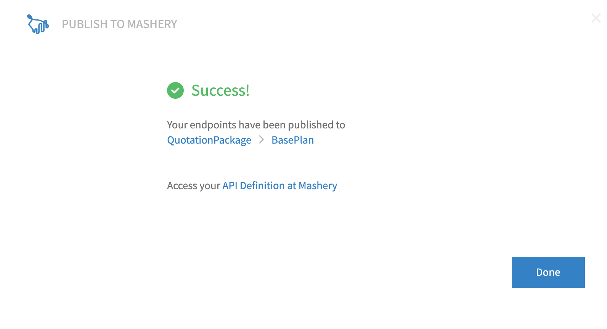

## 4.2 Configure the API Definitions & API Packages ##

Now that you have published the Quotation API to Mashery from within the Integration section TIBCO Cloud, you will adjust the configuration of the API definition and the API package on the APIs section of TIBCO Cloud.

### 4.2.1 Getting Ready ###

In order to able to configure the API definitions and the API packages, you need to navigate to the control center as follows:

1. Navigate to the APIs section:

    

2. Click on **Control Center** so your screen looks like this:

    

### 4.2.1 How to Do It ###

You will first adjust the configuration of the API definition of the Quotation API.

1. From the top menu bar, first select **Design > APIs**,

    

    and then select **QuotationAPI**, so your screen looks like this:

    

2. Select the **Endpoints** section on the left of the screen (if it is not already selected), and click on the gears icon.

	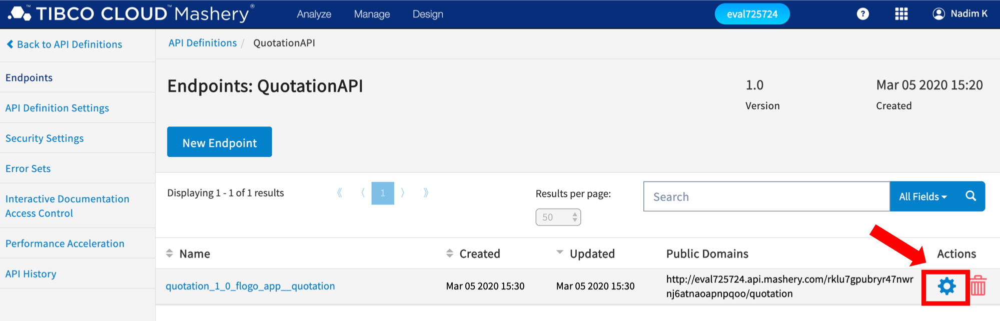

	Edit the public endpoint address path to make it more readable. You can set the path to **v1/quotation** as shown below

	

	Click **Save**, then, from the left menu click **Back to API Endpoints**.

	Copy and save the URL in the **Public Domains** column from the **quotation_1_0_flogo_app__quotation** record, which should match the 		following pattern:
    `http://evalxxxxxx.api.mashery.com/v1/quotation`

4. Select the **Interactive Documentation Access Control** section on the left of the screen, select **Everyone**, and click the blue **Save** button.

    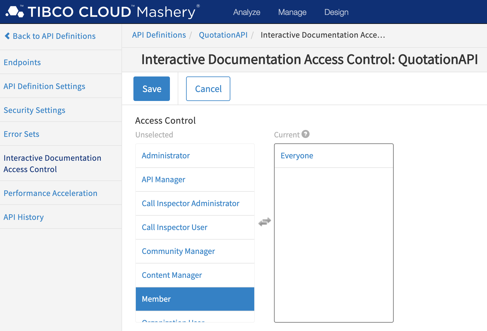

5. Select the **Endpoints** section on the left of the screen again, and click on **quotation_1_0_flogo_app__quotation**. Select the **Key & Method Detection** on the left of the screen, and review the values, and in particular those of the **Developer's API Key Location** and the **Key Field Identifier** fields:

    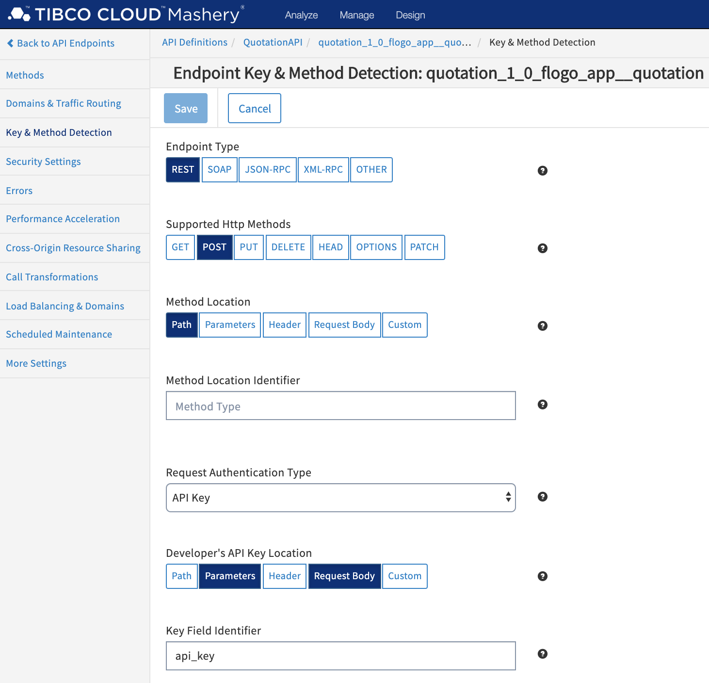

Now you'll adjust the API Package, changing the **BasePlan** that is part of the Quotation API package.

1. From the top menu bar, first select **Design > Packages**,

    

    and then select **QuotationPackage > BasePlan**, so your screen looks like this:

    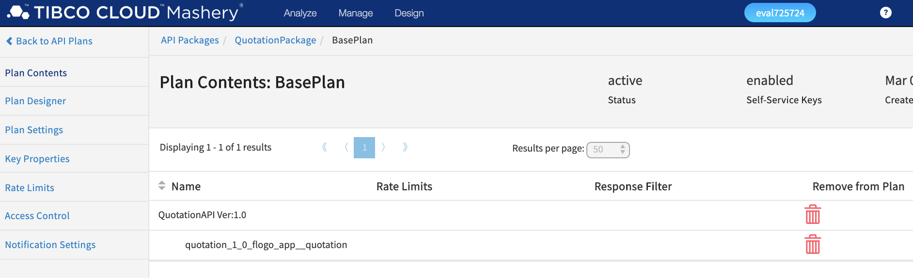

2. Select the **Key Properties** section on the left of the screen and increase the **Number of Keys allowed until Moderation** to **4**, and click the blue **Save** button:

    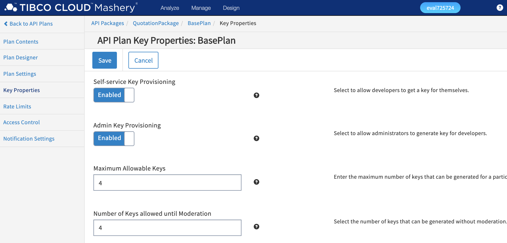

3. Select the **Rate Limits** on the left of the screen and review the default **Throttle**, **Quota**, and **Quota Period** settings, leaving the values as in the following screen.

    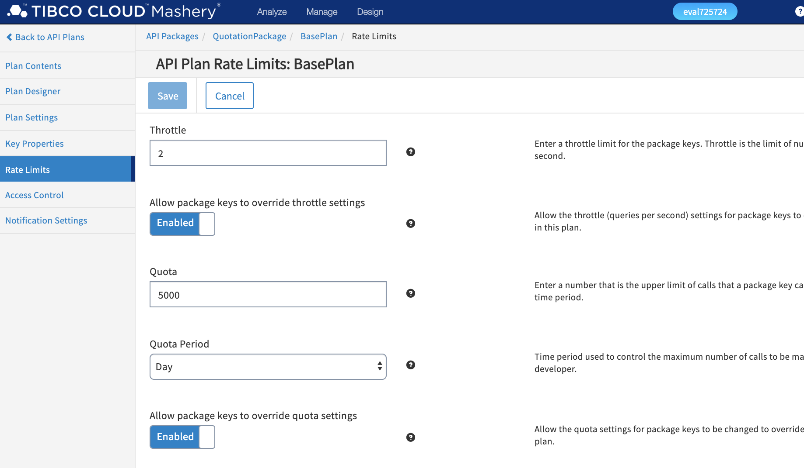

4. Select the **Access Control** section on the left of the screen, select **Everyone**, and click the blue **Save** button.

    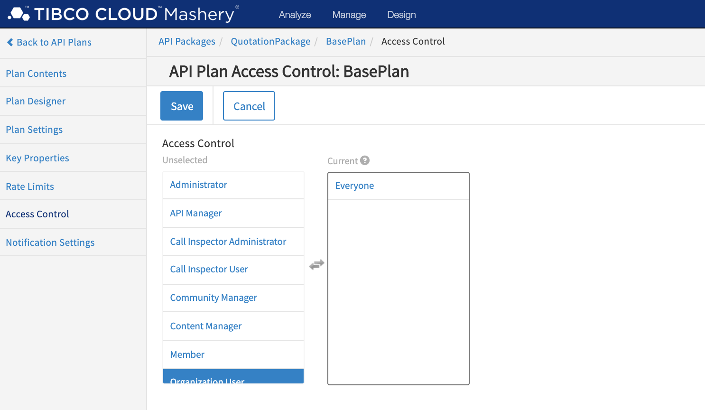


## 4.3 Create Interactive Documentation ##

In this lab, you'll use the adjusted Swagger specification from the previous lab to create interactive documentation for the managed Quotation API.

### 4.3.1 How to Do It ###

1. Go back to TIBCO Cloud home. Go to the API section, then, to API Modelling. Click on the **Quotation** API. 
Hover over the export menu (top right of the screen) and select **json**.  Save the file under QuotationAPI-Mashery.json

	

	_The exported file is the API specification in swagger/OpenAPI format_
2. Edit `QuotationAPI-Mashery.json` file, to add host, security and basePath:
	```json
		"host": "evalXXXXXX.api.mashery.com",
		"schemes": [
		    "http"
		 ],
	    "security": [
			{
				"api_key": []
			}
	    ],
	    "securityDefinitions": {
			"api_key": {
			"type": "apiKey",
			"name": "api_key",
			"in": "query"
	        }
	    },
	    "basePath": "/v1",
	```
	  Your file will look like this:
	  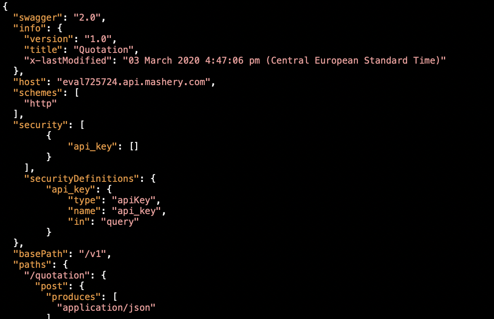
3. Navigate to the **Control Center**. From the top menu bar, first select **Design > Interactive Documentation**,

    

    and then click the **Create your first Interactive Documentation** button.

4. In the following form, select the **Quotation** for the API Definition, select **Swagger** for the format of the document you are uploading, and choose the `Quotation-Mashery.json` from the filesystem as the JSON file to upload.

    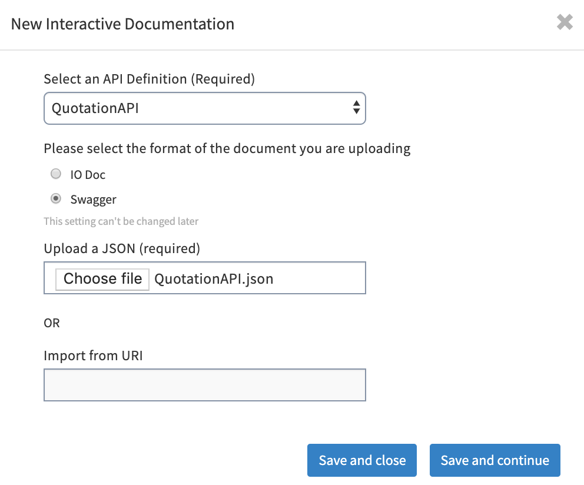

    Click on the **Save and Continue** button.

5. In the following screen, select **Enabled** (if needed), and click the **Save** button.

    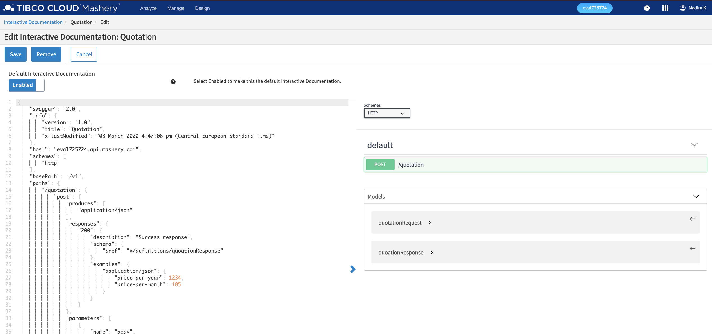

## 4.4 See Also ##

* [TIBCO Cloud™ Mashery Documentation](https://docs.mashery.com)
* [TIBCO Mashery® Community Wiki](https://community.tibco.com/wiki/tibco-mashery-community-wiki)

## 4.5 What's Next ##

[Test your APIs](004.md)
